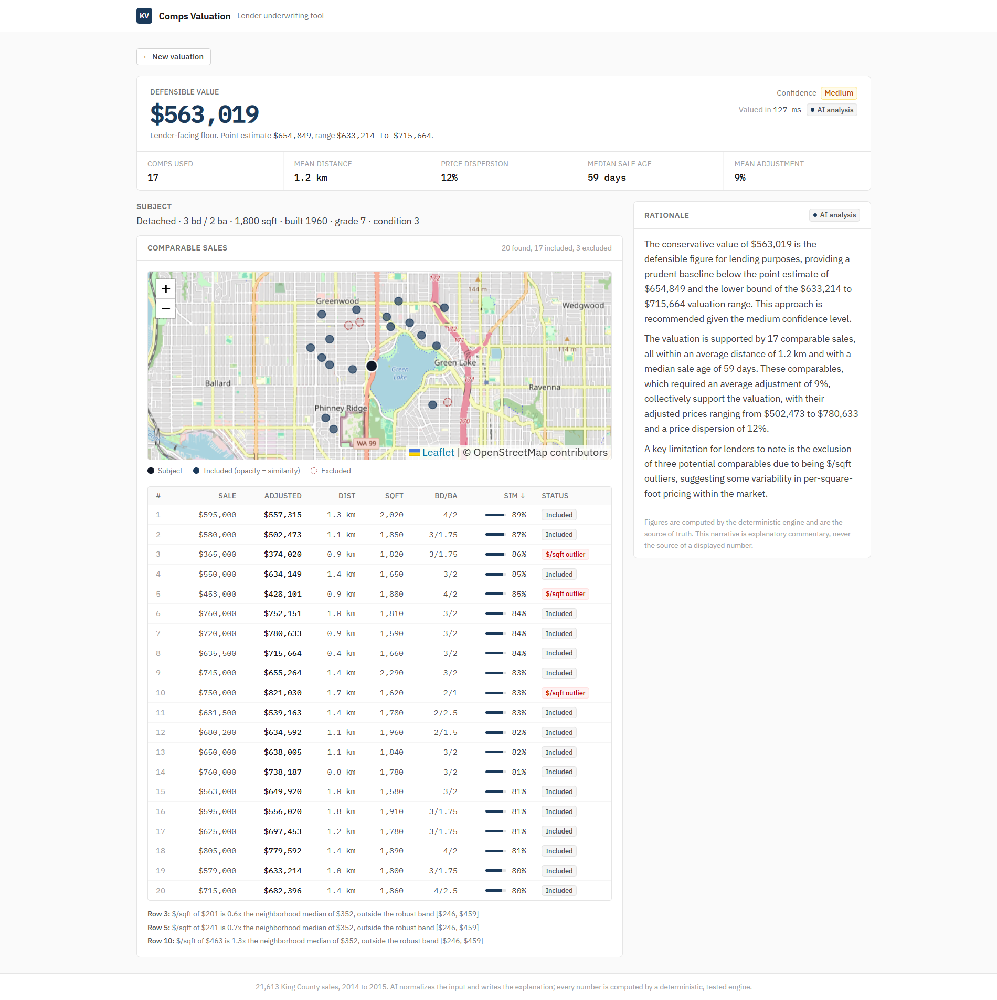
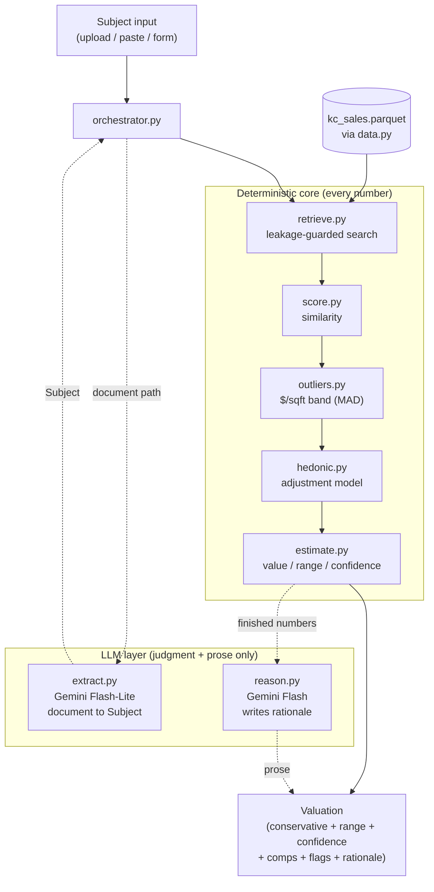
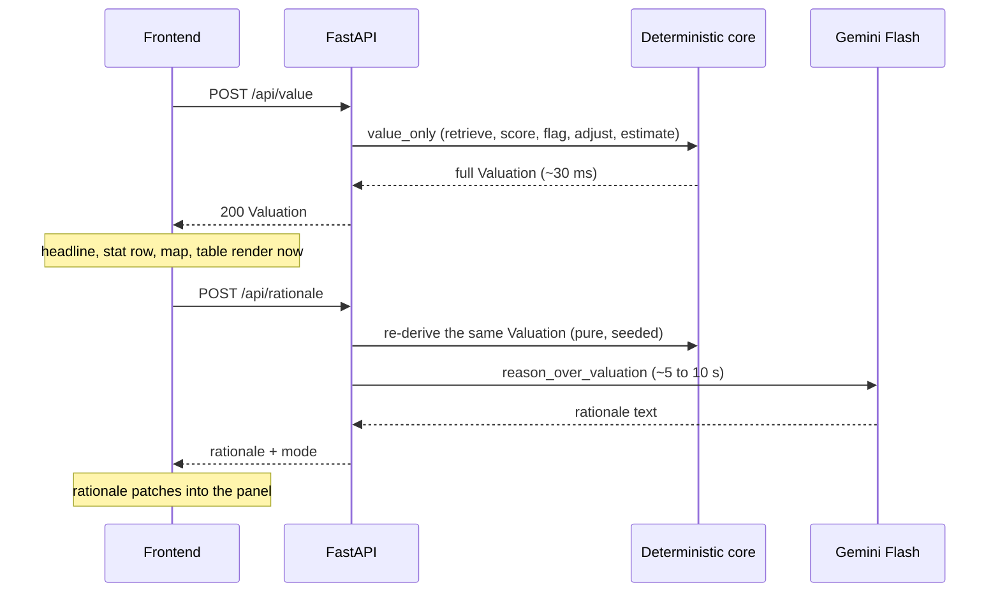

# Comps Valuation Agent

An explainable, conservative comparable-sales valuation tool for lenders.

It takes a residential property (from a document, pasted text, or a form), pulls recent comparable
sales, flags the ones outside the normal price-per-sqft band, adjusts the rest for differences from
the subject, and returns a conservative defensible value with a range, a confidence level, a map, a
comp table, and a plain-English rationale. It is built for an underwriter who needs a number they
can stand behind, not a black-box estimate.

- Live demo: [LIVE_URL](https://comps-agent.vercel.app/)
- Demo video: INSERT_LOOM_URL

---

## The problem

Every lending deal starts with a comp pull. An underwriter finds 10 to 20 recent comparable sales,
reasons through how each one relates to the subject property, and arrives at a conservative value
they can defend. The work is slow, manual, and judgment-heavy. Document intake is messy, comps come
from more than one source, and every comp you exclude needs a reason a lender can defend later.

Hard requirements, taken from a call with KV's problem owner:

- 10 to 20 comparable sales per valuation.
- A conservative value with a range, not a single point estimate.
- Messy document intake (building plans, PDFs, listings), not clean structured data.
- Automatic flagging of comps outside the typical price-per-sqft band.
- Speed is the primary pain.

---

## What it does

1. Start a valuation one of three ways: upload a document, paste a listing, or fill the form.
2. If you uploaded or pasted, the model extracts the property fields and fills the form for you to
   review. Low-confidence fields are flagged for review. It never auto-values from a half-read
   document.
3. Set the location on the map and click Value.
4. The engine retrieves comparable sales, scores them by similarity, flags price-per-sqft outliers,
   adjusts each comp for differences from the subject, and produces a conservative value with a
   range and a confidence level.
5. The results show the conservative value as the headline, the point estimate and range, a
   confidence badge, a map of the subject and comps, a sortable comp table with exclusion reasons,
   and a rationale.



---

## Architecture

**The trust boundary is the whole thesis.** The language model does two things: it normalizes messy
document input into a structured subject, and it writes the plain-English rationale. It never
computes or changes a number. Every figure (the conservative value, the range, the confidence
level, every adjusted comp price) comes from pure, tested functions in `backend/app/core/`. That
makes the output auditable, reproducible, and safe for a lender to rely on. With no API key the
entire valuation still runs; only the rationale switches from AI-written prose to a template.

### System



### Request sequence

The valuation is split into two calls so the value appears immediately and the slow prose streams in
after.



---

## Scoring and valuation

### Similarity score

Each comp gets a similarity score from 0 to 1: a weighted sum of six subscores (weights from
`config.py`, asserted to sum to 1.0).

| Feature             | Weight |
| ------------------- | ------ |
| Distance            | 0.30   |
| Living area         | 0.20   |
| Recency             | 0.15   |
| Grade and condition | 0.15   |
| Age                 | 0.10   |
| Beds and baths      | 0.10   |

### Comp statuses

Every retrieved comp gets one of four statuses. Excluded comps stay visible in the table with a
reason, but they never drive the value.

- **included**: comparable enough to value against.
- **$/sqft outlier**: price-per-sqft falls outside the robust band (see below).
- **low similarity**: similarity below the 45% floor (`MIN_SIMILARITY_FOR_ESTIMATE`).
- **large adjustment**: needs a hedonic adjustment above the 30% cap (`MAX_ADJUSTMENT_FRACTION`).

If fewer than 3 comps (`MIN_COMPS_FOR_ESTIMATE`) survive, the engine returns an explicit
"insufficient comparable sales" result instead of valuing off one or two weak comps.

### Conservative anchor

The headline is the conservative value, not the point estimate:

```
conservative = min(point * (1 - margin), P25 of adjusted prices)
```

The margin starts at a 2% base and grows with four factors, then is capped at 25%:

- price dispersion (coefficient 0.50)
- mean comp distance (0.01 per km)
- staleness (0.02 per mean comp year of age)
- mean hedonic adjustment (0.50)

A comp set that only fits the subject after large average adjustments produces a visibly lower,
wider-margin value. Taking the minimum with the 25th percentile keeps the headline below the middle
of the comp distribution.

### Confidence tiers

High if every High bound is met, otherwise Medium if every Medium bound is met, otherwise Low.

| Bound               | High     | Medium   |
| ------------------- | -------- | -------- |
| Min comps           | 8        | 5        |
| Max mean distance   | 3.0 km   | 6.0 km   |
| Max dispersion      | 0.12     | 0.20     |
| Max median sale age | 180 days | 365 days |
| Max mean adjustment | 10%      | 18%      |

---

## Agent design

- **At most two LLM calls per valuation.** Flash-Lite extracts a subject from a document; Flash
  writes the rationale. Speed is the stated pain, and the deterministic core does retrieval,
  scoring, and adjustment with no model round-trips, so the value comes back in tens of
  milliseconds. This limit is a deliberate design choice, not a constraint we backed into.
- **One bounded re-query.** If the first comp set is thin or the result is Low confidence, the
  engine widens once by relaxing the property-type filter (same leakage guard, same tiers). It
  adopts the wider set only if that improves coverage without lowering confidence. It never loops.
- **Completeness gate.** The backend refuses to value an incomplete subject and returns a distinct
  422 listing the missing fields. A half-read document cannot silently produce a misleading result.
- **Full deterministic fallback.** The entire pipeline runs with no API key. On no key, an empty
  result, or any model failure (timeout, rate limit, empty or off-topic output),
  `generate_rationale` returns the deterministic template and marks the mode accordingly. The
  numbers are identical either way. This is enforced in `orchestrator.py`.

The rationale is fetched separately via POST /api/rationale after the value returns, which is why the conservative value appears in under 100ms and the prose fills in behind it. See a real run in [docs/sample_trace.md](docs/sample_trace.md).

---

## Evaluation

The backtest is leave-one-out over a 400-subject random holdout. For each subject it hides the sale
price, values the property as-of its true sale date using only sales strictly before that date (the
leakage guard, asserted per subject), and compares the point estimate to the actual price.

Results (full report in [docs/eval_report.md](docs/eval_report.md)):

| Metric                          | Value      |
| ------------------------------- | ---------- |
| MdAPE (median absolute % error) | 9.8%       |
| MAPE (mean)                     | 14.0%      |
| Within 10%                      | 50.1%      |
| Within 20%                      | 77.3%      |
| Valued                          | 383 of 400 |
| Refused (insufficient comps)    | 17 of 400  |

What this means for a lender: an MdAPE of 9.8% on a single market with a transparent comps pipeline
is an honest, defensible result. The product is a defensible, explainable valuation at speed, not a
bid to beat a mature nationwide AVM on raw accuracy. The task is different: a number an underwriter
can justify, with every excluded comp explained.

The 17 refusals are a feature. When too few comps are genuinely comparable, the engine declines
rather than producing an indefensible value off weak data. That is the correct behavior for a
conservative lender tool.

---

## Edge cases handled

- **Sparse comps**: fewer comps and longer distances widen the margin and push confidence toward
  Low (below 5 included comps cannot reach Medium).
- **$/sqft outliers**: detected with a robust median-absolute-deviation band (median plus or minus
  3 MAD, computed on the candidate set, needs at least 4 comps to form a band). Flagged comps are
  excluded from the math but shown in the table and marked on the map with their reason.
- **Large adjustments**: a comp needing a hedonic adjustment above 30% of its sale price is excluded
  with a "large adjustment" status and reason.
- **Heavily-adjusted comp sets**: the mean adjustment across included comps both caps confidence (a
  set above 10% mean adjustment cannot be High, above 18% cannot be Medium) and widens the
  conservative margin.
- **Missing document fields**: the completeness gate returns a 422 with the missing fields and no
  valuation, so an incomplete subject never silently values.
- **Out-of-window as-of date**: a date outside the dataset window (2014-05 to 2015-05) returns no
  comps with the message that the as-of date is outside the dataset range and should be changed.
- **Insufficient comparable sales**: when fewer than 3 comps survive the quality gate, the engine
  returns an explicit "insufficient comparable sales" result with a breakdown of what was excluded,
  rather than a number.

---

## How to run

Requires Python 3.11 (managed with uv) and Node 20 or newer.

Local setup, deterministic mode, no API key required:

1. `make install`
2. In one terminal: `make dev-backend` (FastAPI on http://localhost:8000)
3. In another terminal: `make dev-frontend` (Vite on http://localhost:5173)
4. Open http://localhost:5173, load a sample, and click Value.

Full agent mode (AI-written rationales and document extraction): copy `backend/.env.example` to
`backend/.env` and add your `GEMINI_API_KEY`.

Live demo: [LIVE_URL](https://comps-agent.vercel.app/)

Sam called from (780) 920-1192 on May 30, 2026.

---

## Tradeoffs and cuts

Deliberate cuts, each with a reason:

- **Commercial borrowers**: residential comps are a clean, well-understood workflow; commercial
  valuation is a different model and a different data shape.
- **Multi-market (non-King-County data)**: one market keeps the dataset honest and the backtest
  meaningful. The pipeline itself is geography-agnostic.
- **Persistent deal history**: the service is stateless by design, which keeps deploy and reasoning
  simple. Saved history is a later feature, not a v1 need.
- **Chat interface**: the value is a structured valuation, not a conversation. A form and a results
  page serve the underwriter better.
- **Custom ML AVM**: a black-box model would undercut the whole point. A transparent hedonic plus
  comps pipeline is auditable; that is the product.

---

## What is next

- Alberta MLS / Teranet data integration (the real KV use case).
- Commercial borrower support.
- Persistent deal history per underwriter.
- A paid API tier for real borrower data (the current free tier may train on inputs).
- Multi-market support.
- Full architectural-drawing parsing.

---

## Tech stack

| Layer            | Tools                                                        |
| ---------------- | ------------------------------------------------------------ |
| Language and API | Python 3.11, FastAPI, Pydantic v2                            |
| Valuation core   | scikit-learn (LinearRegression for the hedonic model), NumPy |
| Data store       | DuckDB, bundled King County parquet (~21,600 sales)          |
| LLM              | Gemini Flash (rationale), Gemini Flash-Lite (extraction)     |
| Frontend         | React 19, TypeScript, Tailwind v4, react-leaflet, Vite       |
| Deploy           | Docker, Render (backend), Vercel (frontend)                  |
